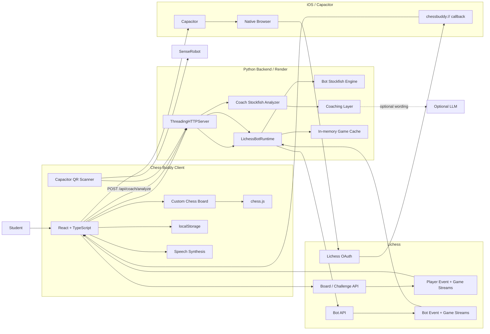
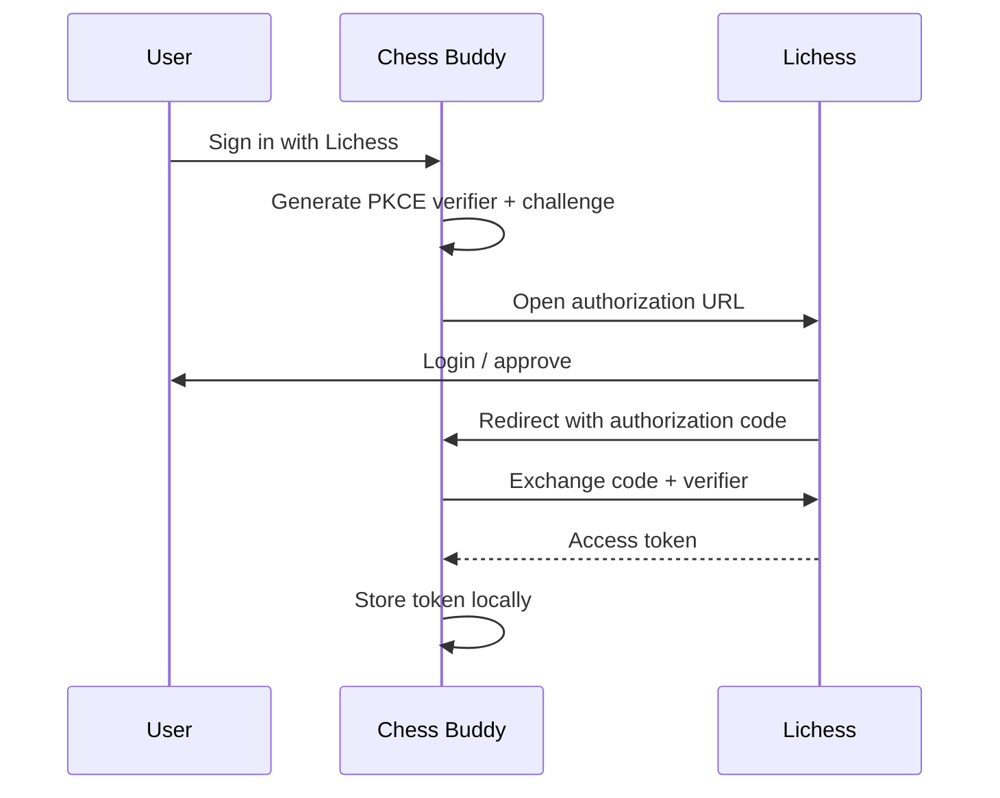
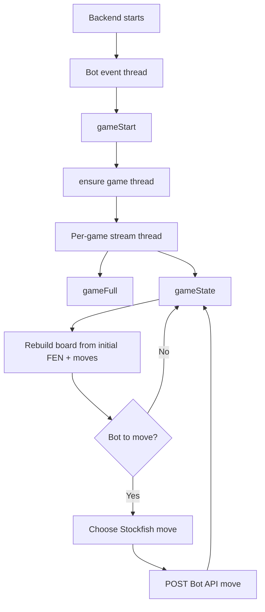
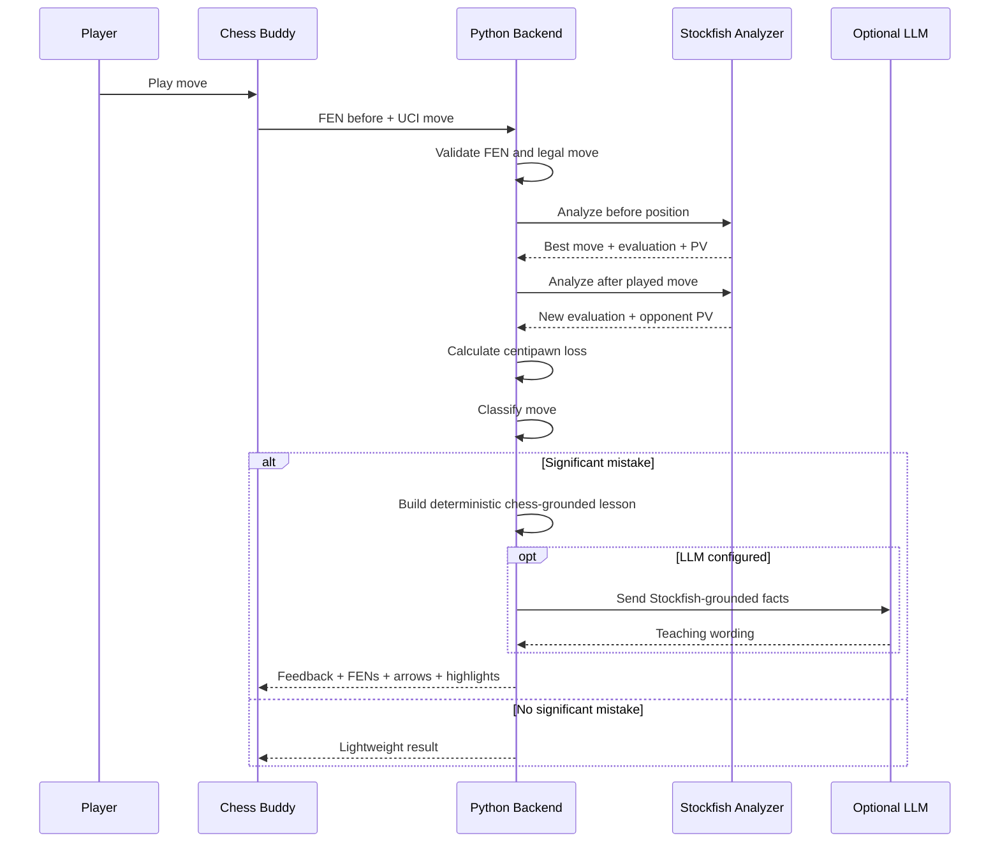
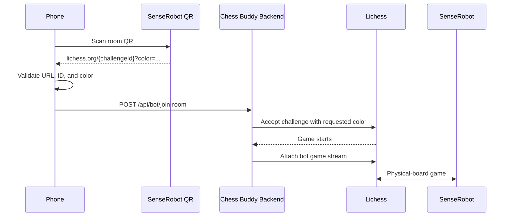
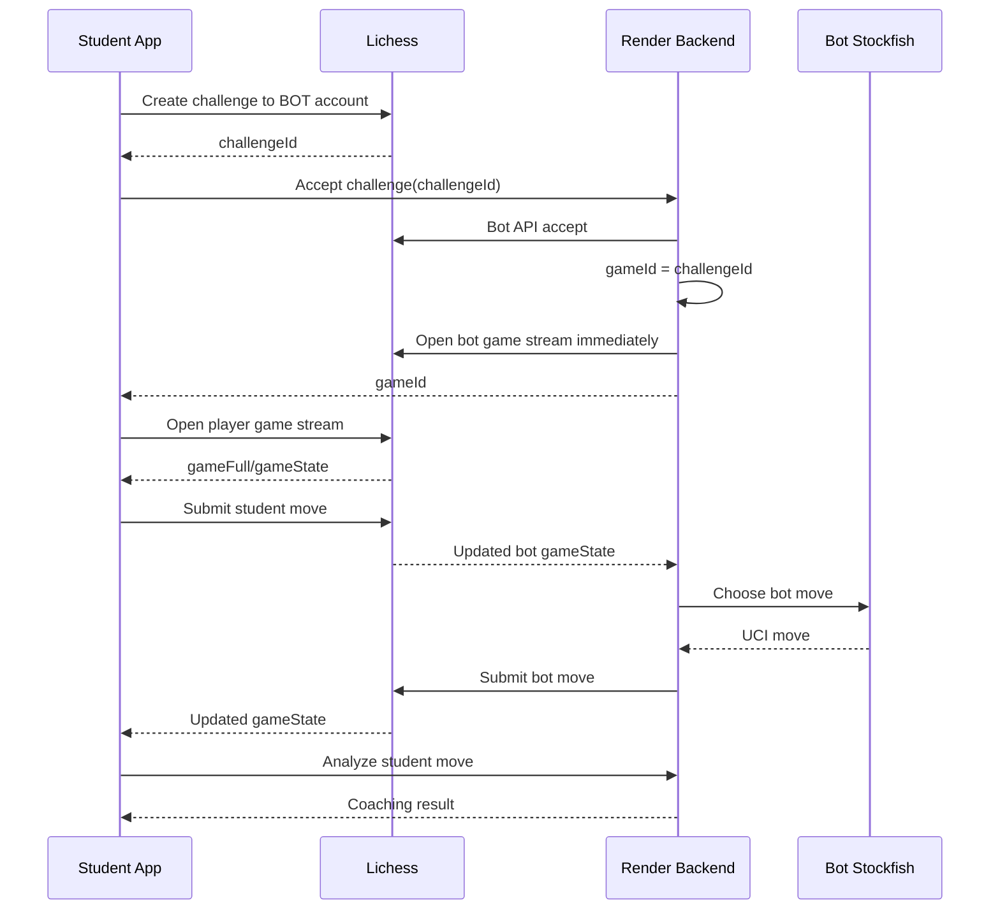

# Chess Buddy — AI Chess Coach

**Current stabilization build: v1.0.4**

Chess Buddy is a real-time chess training system built around Lichess. It combines a React/TypeScript client, an iOS app packaged with Capacitor, Lichess OAuth and Board/Bot APIs, a Python bot-control backend, Stockfish for both opponent play and move evaluation, optional LLM-generated teaching language, persistent mistake review, voice coaching, and SenseRobot room integration through QR scanning.

The goal is not simply to provide a strong chess engine. The system is designed as a **teaching opponent**: the bot can play at multiple practice strengths, every student move can be evaluated, and important mistakes are turned into position-specific lessons that can be reviewed after the game.

---

## Table of contents

1. [System overview](#system-overview)
2. [Architecture](#architecture)
3. [Technology stack](#technology-stack)
4. [Frontend and iOS application](#frontend-and-ios-application)
5. [Lichess authentication](#lichess-authentication)
6. [Lichess player-side integration](#lichess-player-side-integration)
7. [Backend control service](#backend-control-service)
8. [Lichess bot runtime](#lichess-bot-runtime)
9. [Bot difficulty system](#bot-difficulty-system)
10. [Live coaching system](#live-coaching-system)
11. [Learning log and review system](#learning-log-and-review-system)
12. [Chessboard interaction system](#chessboard-interaction-system)
13. [SenseRobot integration](#senserobot-integration)
14. [Game lifecycle](#game-lifecycle)
15. [Recovery and reconnect behavior](#recovery-and-reconnect-behavior)
16. [State and persistence](#state-and-persistence)
17. [API reference](#api-reference)
18. [Environment and configuration](#environment-and-configuration)
19. [Local development](#local-development)
20. [iOS build workflow](#ios-build-workflow)
21. [Render deployment](#render-deployment)
22. [Testing](#testing)
23. [Reliability design](#reliability-design)
24. [Security boundaries](#security-boundaries)
25. [Troubleshooting](#troubleshooting)
26. [Repository layout](#repository-layout)
27. [Design principles](#design-principles)
28. [Future improvements](#future-improvements)

---

# System overview

Chess Buddy has two separate chess actors:

1. **The student/player**
   - Signs in with a normal Lichess account.
   - Uses the Chess Buddy frontend or iOS app.
   - Creates a challenge and submits moves through the Lichess Board API.

2. **The coach bot**
   - Uses a dedicated Lichess BOT account.
   - Runs from the Python backend.
   - Accepts challenges through the Lichess Bot API.
   - Uses Stockfish to choose moves.
   - Maintains its own event stream and per-game streams.

This separation is important. The phone never needs the bot account token, and the backend never needs the student's Lichess access token.

The coaching pipeline is also intentionally separate from the playing bot. The bot chooses a move using one Stockfish workflow, while the coach analyzes the student's move using a second Stockfish workflow.

---

# Architecture



---

# Technology stack

## Frontend

- React 19
- TypeScript
- Vite
- chess.js
- Fetch API
- NDJSON streaming
- Web Speech Synthesis
- browser/WebView `localStorage`

## Native iOS

- Capacitor 8
- `@capacitor/app`
- `@capacitor/browser`
- `@capacitor/barcode-scanner`
- Xcode-generated iOS project
- custom URL scheme for OAuth return

The Capacitor application is configured as:

```text
appId:   com.andy.chessbuddy
appName: Chess Buddy
webDir:  dist
```

## Backend

- Python 3
- `ThreadingHTTPServer`
- python-chess
- requests
- PyYAML
- python-dotenv
- OpenAI Python SDK
- Stockfish

## Deployment

- Docker
- Render
- Stockfish installed inside the backend container
- production frontend points to the Render control service

---

# Frontend and iOS application

The frontend is the main application coordinator.

`src/App.tsx` manages:

- authentication state,
- bot status,
- game creation,
- Lichess event streams,
- Lichess game streams,
- board position reconstruction,
- legal moves,
- clocks,
- player orientation,
- bot difficulty,
- time-control preference,
- move submission,
- coaching,
- voice feedback,
- mistake persistence,
- review boards,
- game-over UI,
- reconnect/recovery state,
- and SenseRobot entry flow.

The same React application runs in a normal browser during development and inside an iOS Capacitor WebView in the native app.

Because Capacitor bundles the built frontend into the iOS project, changing frontend code requires a new Vite build and Capacitor sync before the phone sees the change.

---

# Lichess authentication

Chess Buddy uses **OAuth Authorization Code + PKCE** for the student's Lichess account. The flow is implemented in `src/auth.ts`.

## Requested scopes

```text
board:play
challenge:read
challenge:write
```

## Browser flow



## Native iOS flow

Lichess requires an HTTPS redirect URI. The native app therefore uses a small HTTPS bridge page:

```text
Lichess
  -> HTTPS OAuth callback bridge
  -> chessbuddy://oauth/callback
  -> installed iOS application
```

The native callback scheme is:

```text
chessbuddy://oauth/callback
```

The PKCE verifier and OAuth state are temporarily stored in local storage so they survive the iOS browser-to-app handoff. The application validates the returned OAuth `state` before exchanging the authorization code.

---

# Lichess player-side integration

`src/lichess.ts` contains the student's Lichess client.

It handles:

- account lookup,
- active-game lookup,
- bot challenges,
- move submission,
- resign,
- abort,
- takeback responses,
- account event streaming,
- game streaming,
- and reconnect/backoff logic.

## Account

```text
GET /api/account
```

Used to identify the signed-in student.

## Active games

```text
GET /api/account/playing
```

Used to recover an already-running coach game and avoid accidentally creating duplicate training games.

## Challenge creation

```text
POST /api/challenge/{botUsername}
```

The student creates an unrated standard challenge against the coach bot.

Supported time controls currently include:

| Mode | Lichess clock |
|---|---|
| Unlimited | no clock parameters |
| 30 min | 1800 + 0 |
| 15 + 10 | 900 + 10 |
| 10 + 5 | 600 + 5 |
| 10 min | 600 + 0 |
| 5 + 3 | 300 + 3 |
| 3 + 2 | 180 + 2 |

The chosen time control is remembered locally.

## Move submission

```text
POST /api/board/game/{gameId}/move/{uci}
```

## End-game operations

```text
POST /api/board/game/{gameId}/abort
POST /api/board/game/{gameId}/resign
```

Chess Buddy does **not** use page refresh/unload as an automatic abort or resign signal. Ending a game is an explicit user action.

## Player event stream

```text
GET /api/stream/event
```

This delivers account-level events such as game start.

## Player game stream

```text
GET /api/board/game/stream/{gameId}
```

This is the authoritative source for move list, current status, winner, clocks, and game completion.

---

# Streaming and retry behavior

Lichess streams NDJSON, so `src/lichess.ts` contains a small incremental NDJSON parser.

The reconnect wrapper:

- reopens dropped streams,
- retries temporary failures,
- tolerates a small number of initial `404`s while a new game stream becomes available,
- exponentially backs off,
- and waits significantly longer after a `429` rate limit.

The game stream, rather than optimistic local state, is treated as the source of truth.

---

# Backend control service

The backend is implemented in `server/app.py` and uses Python's standard `ThreadingHTTPServer`.

It has two major jobs:

1. **Run and manage the dedicated Lichess bot.**
2. **Analyze student moves and return coaching.**

At startup it also launches the bot runtime in a background thread.

## Health endpoint

```text
GET /api/health
```

Example response:

```json
{
  "ok": true,
  "stockfish": "/usr/games/stockfish",
  "bot": {
    "running": true,
    "connected": true,
    "username": "bot_2435",
    "level": "club",
    "displayElo": 1400,
    "lastMoveMs": 148,
    "activeGames": 1,
    "lastGameId": "xxxxxxxx",
    "error": null
  },
  "coachTimeMs": 180,
  "mistakeThresholdCp": 80
}
```

This endpoint is useful for distinguishing between the backend process being alive, the bot event stream being connected, and a real active game thread.

---

# Lichess bot runtime

`server/bot_runtime.py` is the central bot orchestration system.

The old design depended on embedding and restarting the external `lichess-bot` project. The current design talks directly to Lichess APIs and owns its Stockfish process itself.

## Runtime threads

The runtime contains one bot event thread plus one thread per active game.



## Startup protection

A dedicated start lock prevents two simultaneous callers from creating duplicate bot event streams. This matters because both backend bootstrap and frontend `/api/bot/start` may try to start the bot at roughly the same time.

## Account validation

Before the runtime starts, it verifies that:

- the token resolves to a Lichess account,
- the account has the `BOT` title,
- and the configured username matches the token owner when a username is explicitly configured.

## Backend restart recovery

When the backend restarts it queries the bot account's active games:

```text
GET /api/account/playing
```

For every active game it finds, it recreates the corresponding game thread. This allows a Render restart to recover a live training game instead of abandoning it.

---

# Direct challenge attachment

A critical race was removed from the normal challenge flow.

For a direct Lichess challenge, the challenge ID is also the resulting game ID. After the bot accepts the challenge, the runtime immediately attaches the per-game stream:

```text
student creates challenge
        ↓
backend accepts challenge
        ↓
game ID = challenge ID
        ↓
backend starts game thread immediately
        ↓
frontend begins play
```

The bot does not wait for a later `gameStart` event before attaching in the normal direct-game flow.

The event stream still provides an independent `gameStart` signal, and `_ensure_game_thread()` makes duplicate attachment safe.

---

# Authoritative game reconstruction

Each game stream starts from `initialFen` plus the complete UCI move list provided by Lichess.

The backend rebuilds a fresh python-chess board from that data. This makes reconnects safe because the backend does not depend on a fragile incremental local board state.

---

# Duplicate move protection

The bot records the ply for which it has already submitted a move.

Before submitting another move, it checks:

```text
gameId + current ply
```

If a move was already submitted for that ply, it does not submit again.

This protects against duplicate Bot API calls when streams reconnect, Lichess repeats state, or the same state is observed more than once.

If move submission fails, the submitted-ply marker is cleared so the bot can retry.

---

# Takeback support

Training takebacks are supported.

The bot watches the game-state takeback flags and automatically accepts an opponent takeback request.

A `(gameId, ply)` signature prevents the same request from being accepted repeatedly.

---

# Rate-limit protection

Lichess `429` responses trigger a shared backend cooldown.

During cooldown:

- bot API calls pause,
- the error is exposed through runtime status,
- and requests resume after the cooldown window.

This prevents multiple threads from independently hammering Lichess after one thread has already discovered a rate limit.

---

# Terminal game diagnostics

When Lichess sends a terminal state, the runtime logs information such as:

```text
[GAME TERMINAL] game=xxxxxxxx status=aborted moves='g1f3' winner=None
```

This helps separate a frontend problem, a bot problem, a Lichess game transition, or an external client interfering with the same game.

---

# Bot difficulty system

The bot is designed as a **practice opponent**, not a literal Elo simulator.

| Level | Estimated practice strength | Think time | MultiPV | Temperature |
|---|---:|---:|---:|---:|
| Newcomer | ~500 | 45 ms | 10 | 330 cp |
| Beginner | ~800 | 60 ms | 9 | 210 cp |
| Developing | ~1100 | 80 ms | 7 | 125 cp |
| Club | ~1400 | 110 ms | 6 | 70 cp |
| Strong | ~1700 | 160 ms | 4 | 34 cp |
| Expert | ~2000 | 240 ms | 3 | 14 cp |

These are teaching-strength estimates, not official Lichess ratings.

## Difficulty algorithm

A weak chess bot should not feel weak merely because it waits longer. Chess Buddy keeps engine search times short and changes the **quality distribution** of the move choice.

Stockfish evaluates several candidate moves using MultiPV.

For each candidate:

```text
loss = bestScore - candidateScore
weight = exp(-loss / temperature)
```

A weighted random choice is then made.

### Lower levels

- larger MultiPV,
- larger temperature,
- more willingness to choose inferior but still legal/reasonable moves.

### Higher levels

- smaller candidate set,
- lower temperature,
- much stronger preference for the best engine move.

This produces different playing strength while keeping the bot responsive at every level.

---

# Stockfish failure behavior

The bot owns a long-lived Stockfish process.

If Stockfish fails while choosing a move:

1. the engine process is reset,
2. the bot chooses one legal fallback move,
3. the next turn starts a fresh Stockfish process.

A transient engine failure therefore does not automatically forfeit the game.

---

# Live coaching system

The live coach is a second system from the playing bot.

The frontend sends:

```json
{
  "fen": "position before the student's move",
  "move": "student move in UCI",
  "detail": "quick | balanced | deep"
}
```

to:

```text
POST /api/coach/analyze
```

## Coaching data flow



---

# Engine truth vs teaching language

A key design rule is:

> **Stockfish decides the chess facts. The language model only improves how those facts are explained.**

Stockfish determines evaluation, centipawn loss, best move, opponent response, principal variations, mistake classification, and FEN snapshots.

The optional LLM can improve title, explanation, lesson wording, and self-reflection question.

If the LLM is unavailable or no API key is configured, the system falls back to deterministic Stockfish-based coaching.

The core coaching system therefore does not depend on the LLM being available.

---

# Move classification

| Centipawn loss | Classification |
|---:|---|
| `< 35` | Good |
| `35–89` | Inaccuracy |
| `90–199` | Mistake |
| `>= 200` | Blunder |

The independent live-coach trigger defaults to:

```text
COACH_MISTAKE_THRESHOLD_CP=80
```

That threshold determines whether a move is important enough to interrupt the student with coaching.

---

# Position-aware coaching

For every analyzed move the system preserves both:

```text
fenBefore
fenAfter
```

This is necessary because two different coaching ideas live in two different positions.

## Better move

The best alternative belongs to the position **before** the student's move.

## Opponent threat

The tactical punishment belongs to the position **after** the student's move.

Chess Buddy keeps these contexts separate so historical arrows are never painted on the wrong board state.

---

# Annotation validation

The server does not blindly trust model-generated board annotations.

Potential highlight squares are checked against legal/contextual squares derived from the played move, Stockfish's best move, the best line, the opponent reply, and the refutation line.

Only validated squares are returned to the board. Best-move and danger arrows are derived from engine UCI moves.

---

# Fast-play coaching queue

When a player moves quickly, live coaching must not lose an earlier mistake simply because a new move happened before the previous analysis completed.

The improved live-coach design uses a **FIFO analysis queue**:

```text
student move 1
student move 2
student move 3
      ↓
coach queue
      ↓
analyze move 1
analyze move 2
analyze move 3
```

Important behavior:

- a new move does not cancel the analysis of an older move,
- each job stores the exact `fenBefore` and UCI move,
- Stockfish analyses are serialized,
- important results are still written to the learning log,
- and fast play cannot silently erase a mistake.

At the start of a new game, the queue is cleared and any current request is cancelled.

---

# Learning log and review system

Important coaching results become `CoachNote` entries.

The learning log stores recent mistakes per game and survives refresh/restart of the frontend.

Current persistence limits are intentionally small:

- up to 16 notes per game,
- up to 8 recent learning sessions.

Each note keeps enough information to reconstruct the exact coaching context, including game ID, move/ply, classification, centipawn loss, best move, opponent reply, `fenBefore`, `fenAfter`, explanation, lesson, question, arrows/highlights, player color, and save timestamp.

## Review board

Clicking a learning-log entry opens a historical board instead of painting old arrows over the current live board.

### Better move

Shows `fenBefore` with the stronger alternative.

### Opponent threat

Shows `fenAfter` with the forcing opponent response.

The board orientation is preserved from the player's original side.

---

# Voice coaching

Voice coaching uses the browser/WebView Speech Synthesis API.

When enabled:

1. coaching text is generated,
2. any previous speech is cancelled,
3. a new `SpeechSynthesisUtterance` is created,
4. the explanation is spoken to the student.

Voice is optional and does not affect analysis or game state.

---

# Chessboard interaction system

`src/components/ChessBoard.tsx` is a custom chessboard implementation rather than an embedded third-party board.

It supports:

- FEN rendering,
- white/black orientation,
- legal destination markers,
- click-to-move,
- drag-to-move,
- capture destinations,
- last-move highlighting,
- optimistic local move animation,
- remote/bot move animation,
- coach arrows,
- coach highlights,
- user-drawn arrows,
- user square highlights,
- rollback/reset signals,
- and responsive sizing.

Pieces are currently rendered with Unicode chess glyphs.

Recent visual tuning widens the king and queen slightly on iOS so those glyphs do not appear unnaturally compressed compared with the other pieces.

---

# Board input reliability

A major source of subtle bugs in fast games is the gap between what the player just dragged locally and what the authoritative Lichess stream has confirmed.

Chess Buddy therefore treats a submitted move as **pending**.

The UI may animate it immediately, but the Lichess stream remains authoritative.

As soon as the stream advances away from the source FEN:

- the optimistic piece is removed,
- local drag state is cleared,
- and the streamed position is rendered.

This also handles the case where the bot replies so quickly that the frontend effectively jumps from `before student move` straight to `after bot reply` without spending visible time on the intermediate position.

Pointer capture is attached to the board element so dragging remains stable even if the piece moves underneath the pointer.

---

# SenseRobot integration

Chess Buddy includes a native QR-code flow for joining a SenseRobot Lichess room.

`src/senseScanner.ts` uses Capacitor's barcode scanner.

## Scan flow



## QR validation

The scanner only accepts:

- HTTPS,
- `lichess.org`,
- a single 8-character challenge ID,
- and a `color=white` or `color=black` parameter.

This prevents arbitrary QR content from being treated as a bot room.

## Important SenseRobot testing note

A SenseRobot session can act as another active Lichess client/game participant.

When testing a **normal direct Chess Buddy training game**, make sure the SenseRobot is not simultaneously active in a way that controls or joins the same account/game.

A competing SenseRobot session can make a newly-created training game appear to abort even though the Render bot attached correctly, `activeGames` briefly became `1`, and the Chess Buddy frontend itself never called the abort endpoint.

---

# Game lifecycle

## Normal direct training game



---

# New-game safety

Before creating a new challenge, the frontend checks whether the student already has an active game against the configured coach bot.

This prevents duplicate training sessions.

The currently active game ID is also stored locally. Refreshing or reopening the application can therefore recover the same game instead of creating a new one.

---

# Recovery and reconnect behavior

Recovery exists on both sides of the system.

## Frontend recovery

The frontend:

1. reads the saved game ID from local storage,
2. tries to reconnect to that game stream,
3. checks `/api/account/playing` when necessary,
4. adopts a currently-active coach game if one exists,
5. discards a stale saved ID when Lichess confirms the game is gone.

## Backend recovery

The backend:

1. starts the bot event stream,
2. queries the bot account's active games,
3. recreates per-game threads for each active game,
4. rebuilds every board from Lichess state.

## Stream recovery

Both player and bot stream code use retry/backoff.

The system is designed around the assumption that long-lived HTTP streams can disconnect. A dropped stream is not interpreted as the end of a chess game.

---

# State and persistence

Chess Buddy intentionally has no application database in the current architecture.

State is divided by responsibility.

## Lichess — authoritative game state

Lichess owns moves, game status, clocks, winner, challenge lifecycle, takebacks, and game history.

## Frontend localStorage — user experience state

The client persists items such as:

- Lichess player access token,
- active game ID,
- selected time control,
- coach detail,
- learning sessions,
- saved coaching notes.

Representative storage keys include:

```text
lichess_access_token
ai-chess-coach.active-game.v1
ai-chess-coach.learning-log.v2
ai-chess-coach.time-control.v1
ai-chess-coach.coach-detail.v1
```

## Backend memory — operational state

The Python process keeps transient runtime state such as active bot game threads, cached streamed game state, submitted ply markers, seen takeback signatures, recent game-start events, active difficulty, bot connection status, latest error, latest move latency, and API cooldown state.

Because this is operational state rather than permanent game history, it can be reconstructed from Lichess after a restart.

---

# API reference

## Health and status

### `GET /api/health`

Returns backend status, Stockfish discovery, bot status, coach analysis budget, and mistake trigger.

### `GET /api/bot/status`

Returns current bot runtime status.

### `GET /api/bot/levels`

Returns configured practice levels.

### `GET /api/bot/game/{gameId}/state`

Returns the latest backend-cached state for a bot game.

## Bot control

### `POST /api/bot/start`

Starts the bot runtime if it is not already active.

### `POST /api/bot/stop`

Stops the bot runtime.

### `POST /api/bot/level`

```json
{
  "level": "club"
}
```

Changes difficulty without restarting the bot or terminating active games.

### `POST /api/bot/challenge/{challengeId}/accept`

```json
{
  "opponent": "student_username"
}
```

Accepts a normal direct challenge and attaches the bot game stream.

### `POST /api/bot/join-room`

```json
{
  "challengeId": "abcdefgh",
  "color": "black"
}
```

Used by the SenseRobot room flow.

## Coaching

### `POST /api/coach/analyze`

```json
{
  "fen": "rnbqkbnr/pppppppp/8/8/8/5N2/PPPPPPPP/RNBQKB1R b KQkq - 1 1",
  "move": "g1f3",
  "detail": "balanced"
}
```

Returns move classification, centipawn loss, best move, opponent reply, before/after FENs, feedback, lesson, question, arrows, and highlights.

---

# Environment and configuration

Copy the example environment file and keep secrets out of Git.

```env
LICHESS_BOT_TOKEN=
LICHESS_BOT_USERNAME=bot_2435

# Optional LLM layer
OPENAI_API_KEY=
OPENAI_MODEL=

# Optional tuning
STOCKFISH_PATH=/opt/homebrew/bin/stockfish
CHESS_SERVER_PORT=8765
COACH_TIME_MS=250
COACH_TIME_MS_QUICK=250
COACH_TIME_MS_BALANCED=800
COACH_TIME_MS_DEEP=2000
COACH_MISTAKE_THRESHOLD_CP=80
```

Coach detail controls both Stockfish strength and explanation depth. Quick
uses the shortest search for responsive live feedback, Balanced spends more
time validating the best move and the played move, and Deep uses the longest
search plus a longer principal variation. Each non-best move can require two
Stockfish searches, so total analysis time can be roughly twice the configured
per-search budget.

## Frontend variables

The frontend also recognizes variables such as:

```env
VITE_BOT_CONTROL_URL=http://127.0.0.1:8765
VITE_COACH_BOT_USERNAME=bot_2435
VITE_LICHESS_CLIENT_ID=...
VITE_LICHESS_REDIRECT_URI=...
```

The checked-in production configuration points the frontend at the Render backend.

---

# Local development

## Requirements

- macOS
- Python 3.10+
- Node 20.19+ or 22.12+
- npm
- Stockfish
- a dedicated Lichess BOT account/token

Install Stockfish:

```bash
brew install stockfish
```

Run project setup:

```bash
./setup_mac.sh
```

Create/edit `.env` with the bot credentials.

## Run everything

```bash
./dev.sh
```

Then open:

```text
http://localhost:5173
```

## Or use two terminals

Backend:

```bash
./run_backend.sh
```

Frontend:

```bash
./run_web.sh
```

---

# iOS build workflow

The iOS app embeds the built Vite output from `dist/`.

After frontend changes:

```bash
npm run typecheck
npm run build
npx cap sync ios
npx cap open ios
```

Then in Xcode:

1. choose the iPhone/device,
2. build and run,
3. verify the newly-installed app is using the expected code.

## Frontend-only change

Examples:

```text
src/App.tsx
src/lichess.ts
src/components/ChessBoard.tsx
src/styles.css
src/senseScanner.ts
```

Requires:

```text
npm build + Capacitor sync + Xcode install
```

It does **not** require a Render redeploy.

## Backend change

Examples:

```text
server/app.py
server/bot_runtime.py
server/coach/*
```

Requires a Render redeploy.

It does **not** require an iOS sync unless frontend code also changed.

---

# Render deployment

The backend is containerized.

The Docker image:

1. starts from Python 3.12 slim,
2. installs Stockfish through `apt`,
3. installs Python requirements,
4. copies `server/` and `bot/`,
5. sets the Stockfish path,
6. launches `python server/app.py`.

Production Stockfish path:

```text
/usr/games/stockfish
```

The frontend production control URL currently points to the Render service.

## Typical deploy flow

```bash
git status
git add .
git commit -m "Describe the change"
git push origin main
```

Then either allow Render auto-deploy to deploy `main` or use **Manual Deploy → Deploy latest commit**.

For debugging, always verify that Render is actually running the expected commit before assuming a backend code change is live.

---

# Testing

## TypeScript

```bash
npm run typecheck
npm run build
```

## Python

```bash
./.venv/bin/python -m unittest discover -s tests -v
```

The existing unit tests cover core behavior such as level progression, board reconstruction, duplicate-move protection, takeback direction, and move classification.

## Live integration testing

Offline tests do not fully reproduce Lichess.

Important live tests include:

### Challenge lifecycle

```text
create challenge
→ bot accepts
→ activeGames = 1
→ student move
→ bot reply
```

### Difficulty changes

```text
play game
→ change difficulty
→ start another game
→ verify bot remains connected
```

Changing difficulty should only update the runtime level; it should not restart the bot or abort an active game.

### Time-control changes

Test each clock mode, including Unlimited.

### Fast-play coaching

Make several moves quickly and verify every student move is still processed by the coach queue and important earlier mistakes are not lost.

### Recovery

Restart the frontend, iPhone app, or backend during a live game and confirm recovery works.

### SenseRobot isolation

Test direct Chess Buddy games with the SenseRobot inactive, then test the QR room flow separately.

---

# Reliability design

The system includes multiple defenses against race conditions and transient failures.

## Lichess is authoritative

Local board animations never override server-streamed game state.

## Idempotent game-thread creation

`_ensure_game_thread(gameId)` does nothing if the thread is already alive. This lets direct challenge handling and `gameStart` events safely converge.

## Immediate direct-game attachment

The bot attaches immediately after accepting a normal direct challenge.

## Rebuild instead of patch

After reconnect, the board is reconstructed from complete streamed state.

## Duplicate-ply protection

A bot move can only be submitted once for a given observed ply.

## Engine recovery

A broken Stockfish process is replaced instead of killing the game.

## Shared rate-limit cooldown

One `429` slows all bot API threads.

## Stream retry

Both client and backend assume network streams can disappear and reconnect.

## Recovery from Lichess

Neither client nor backend relies exclusively on local memory to identify an active game.

---

# Security boundaries

The project has two different Lichess credentials.

## Student token

- created through OAuth PKCE,
- stored in the client/WebView,
- used only for the student's Board/Challenge APIs.

## Bot token

- configured on the backend,
- must belong to a Lichess BOT account,
- should never be shipped in the iOS bundle,
- should never be committed to Git.

## CORS

The backend currently allows known development/native origins such as:

```text
capacitor://localhost
http://localhost:5173
http://127.0.0.1:5173
```

### Production-hardening note

CORS is a browser policy, not authentication.

The control API currently should be treated as a trusted-service interface. If the backend is exposed publicly for broader production use, add an application-level authentication/authorization mechanism or restrict access at the deployment layer.

---

# Troubleshooting

## Bot appears offline

Check `LICHESS_BOT_TOKEN` and `LICHESS_BOT_USERNAME`, then inspect:

```text
GET /api/health
```

Look separately at:

```text
running
connected
activeGames
error
```

## `running=true` but `connected=false`

The process exists, but the Lichess bot event stream is disconnected. Check Render logs for network errors, rate limiting, or token problems. The runtime should attempt to reconnect automatically.

## `activeGames` briefly becomes `1` and then `0`

Look for:

```text
[GAME TERMINAL]
```

in Render logs.

A transition from `1` to `0` means the game thread existed and then observed a terminal Lichess state. This is different from "the backend never attached."

Also check whether another active chess client, including SenseRobot, is interacting with the same Lichess game.

## Unexpected game abort

The normal Chess Buddy UI only aborts through the explicit end-game flow.

If a game still aborts after the frontend abort path is ruled out, inspect Render terminal logs, Lichess game state, other logged-in clients, and SenseRobot activity.

## Live coach misses mistakes when playing quickly

The coach should queue move-analysis jobs rather than cancelling the previous analysis when the next student move arrives.

Each queued job must preserve:

```text
fenBefore + UCI move
```

so it remains correct even after the live board advances.

## Stockfish not found

macOS:

```bash
brew install stockfish
```

Or configure:

```env
STOCKFISH_PATH=/full/path/to/stockfish
```

Render/Docker uses:

```text
/usr/games/stockfish
```

## Stockfish UCI managed-option error

Do not manually configure python-chess-managed options such as `Ponder`, `MultiPV`, `UCI_Chess960`, or `UCI_Variant`.

The project filters managed options and only directly configures ordinary supported options such as `Threads` and `Hash`.

## Game is open on Lichess but Chess Buddy looks stale

Refresh/reopen the app. The frontend stores the active game ID, reconnects the game stream, and checks `/api/account/playing`. A stale saved ID is removed only when Lichess indicates that game is no longer active.

## Piece dragging behaves incorrectly

The board should own pointer capture. The optimistic move must clear when the authoritative FEN changes.

## King or queen looks too narrow on iPhone

Unicode chess glyph proportions vary by iOS fallback font. Chess Buddy applies a small horizontal scale adjustment to king/queen pieces so those glyphs visually match the rest of the set.

## No LLM API key

The chess coach still works. Stockfish analysis and deterministic coaching remain available; only the optional language-enhancement layer is skipped.

---

# Repository layout

```text
ai-chess-coach/
│
├── bot/
│   └── config.yml                # Optional local bot credential fallback
│
├── ios/
│   └── App/                      # Capacitor-generated native iOS project
│
├── server/
│   ├── app.py                    # HTTP control + coaching API
│   ├── bot_runtime.py            # Lichess BOT runtime and bot Stockfish engine
│   └── coach/
│       ├── llm_coach.py          # Optional teaching-language layer
│       ├── stockfish_analyzer.py # Deterministic move analysis
│       └── prompts/
│           └── ...               # Coaching prompt/instructions
│
├── src/
│   ├── App.tsx                   # Main client/game/coaching state machine
│   ├── auth.ts                   # Lichess OAuth PKCE + iOS deep-link handling
│   ├── botControl.ts             # Calls Chess Buddy backend
│   ├── coach.ts                  # Coaching API client
│   ├── lichess.ts                # Player-side Lichess API + streaming
│   ├── senseScanner.ts           # Native SenseRobot QR scan flow
│   ├── styles.css                # App/board styling
│   ├── main.tsx                  # React entry point
│   └── components/
│       └── ChessBoard.tsx        # Custom interactive chessboard
│
├── tests/
│   └── test_core.py              # Python unit tests
│
├── .env.example
├── .env.production
├── capacitor.config.ts
├── Dockerfile
├── package.json
├── requirements.txt
├── dev.sh
├── run_backend.sh
├── run_web.sh
├── setup_mac.sh
└── README.md
```

---

# Design principles

## 1. Lichess is the source of truth

The UI may be optimistic for responsiveness, but streamed state wins.

## 2. Chess facts come from Stockfish

The teaching model does not invent evaluations or best moves.

## 3. LLM failure should not break chess

The deterministic coach is always available.

## 4. Weak bots should still feel responsive

Strength is varied through candidate quality, not fake delays.

## 5. Network streams will fail

Reconnect is part of the normal design, not an exceptional afterthought.

## 6. State should be recoverable

Important game state is derived from Lichess rather than being trapped in process memory.

## 7. Review must be position-correct

Historical arrows belong on historical FENs, not the current live board.

## 8. Fast play should not erase learning

Move analyses are queued so a player's next move does not cancel an important previous mistake.

## 9. Native and backend deployment are separate

A Render redeploy does not update the iPhone bundle, and an iOS sync does not update Render.

---

# Future improvements

Potential next steps:

- add authenticated access to the public backend control API,
- move the largest `App.tsx` state machines into smaller hooks/services,
- add end-to-end tests around a mock NDJSON Lichess stream,
- add explicit frontend/backend build versions to the UI and `/api/health`,
- surface game-thread and coaching-queue metrics,
- persist learning history to an optional account-backed database,
- add structured logging instead of plain console lines,
- add automated Render smoke tests,
- add a dedicated native settings/storage layer for tokens,
- expand post-game recurring-theme summaries,
- add selectable chess piece sets instead of relying only on Unicode glyphs.

---

# Summary

Chess Buddy is composed of several cooperating real-time systems:

```text
iOS / React UI
    ↓
Lichess player API
    ↓
Lichess authoritative game state
    ↑
Python bot runtime on Render
    ↓
Stockfish teaching opponent

Student move
    ↓
Python coach API
    ↓
Stockfish deterministic analysis
    ↓
Optional LLM wording
    ↓
Live coach + voice + learning log + review board

SenseRobot QR
    ↓
Capacitor scanner
    ↓
Backend room join
    ↓
Lichess Bot API
```

The architecture deliberately separates:

- **player identity from bot identity,**
- **gameplay from coaching,**
- **engine truth from teaching language,**
- **optimistic UI from authoritative streamed state,**
- and **native deployment from backend deployment.**

That separation is what allows Chess Buddy to remain responsive while still recovering from reconnects, backend restarts, fast bot moves, fast student moves, Stockfish failures, and optional AI-service failures.
